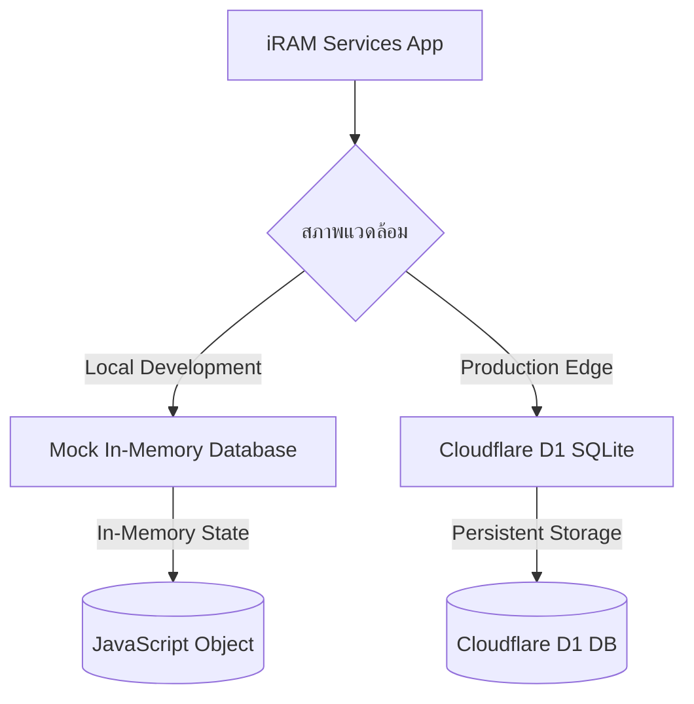

# รายงานการเชื่อมต่อระบบฐานข้อมูล (Database Connection Report)
**โครงการ:** iRAM Services Research System  
**วันที่อัปเดต:** 16 มิถุนายน 2026  
**เวอร์ชัน:** v2.0 - Mock + D1 Only

---

## 🏗️ 1. สถาปัตยกรรมการเชื่อมต่อฐานข้อมูล (Database Architecture)

ระบบถูกออกแบบให้มีความเรียบง่ายสูง โดยรองรับการทำงานได้ **2 รูปแบบเท่านั้น**:



### รายละเอียดการกำหนดค่าการเชื่อมต่อ (Connection Setup)

| พารามิเตอร์ | รายละเอียด | สถานะ |
|:---|:---|:---|
| **โหมดพัฒนา (Local)** | Mock In-Memory Database | ✅ ใช้งานได้ทันที |
| **โหมดใช้งานจริง (Production)** | Cloudflare D1 (Serverless SQLite) | ✅ พร้อมสำหรับ Production |
| **D1 Database Name** | `iram-db` | กำหนดใน `wrangler.toml` |
| **D1 Database ID** | `d813fc54-881b-47b0-b6a0-6774afe3cf2f` | กำหนดใน `wrangler.toml` |

---

## 💻 2. ชุดคำสั่งสำคัญในการควบคุมระบบ (Essential Commands)

### 🔴 การพัฒนาในเครื่อง (Local Development)
```bash
# รัน Dev Server พร้อม Mock Data
npm run dev
```
✅ ไม่ต้องตั้งค่าฐานข้อมูลใดๆ - ข้อมูลจำลองพร้อมใช้ทันที

### 🟢 การส่งขึ้นระบบคลาวด์ (Production Deploy)
```bash
# 1. สร้างโครงสร้าง Next.js
npm run build

# 2. อัปเดตสคีมา D1 Database (ครั้งแรกเท่านั้น)
npx wrangler d1 execute iram-db --file=./d1-schema.sql --remote

# 3. ส่งโค้ดขึ้น Cloudflare
npx wrangler deploy --no-bundle
```

---

## 🛠️ 3. ระบบเลือกโหมดฐานข้อมูล (Operation Modes)

### A. โหมดฐานข้อมูลจำลอง (Mock Database Mode) - ⭐ Default

**การใช้งานหลัก:** การพัฒนาโค้ด, ทดสอบหน้า UI, การทำงานออฟไลน์

**วิธีเปิดใช้งาน:**
```bash
npm run dev
```

✅ **ข้อดี:**
- ไม่ต้องตั้งค่า - ทำงานได้ทันที
- ข้อมูลจำลองมีอยู่แล้ว
- ไม่ต้องเชื่อมต่อเครือข่าย
- ปลอดภัยสำหรับการพัฒนา

### B. โหมดใช้งานจริงบน Cloudflare D1 (Production Mode)

**การใช้งานหลัก:** การติดตั้งระบบใช้งานจริงบน Cloudflare Pages

**วิธีการ Deploy:**
```bash
# ขั้นตอน 1: สร้าง production build
npm run build

# ขั้นตอน 2: อัปเดต D1 Schema (ครั้งแรกหรือเมื่อมีการเปลี่ยนแปลง)
npx wrangler d1 execute iram-db --file=./d1-schema.sql --remote

# ขั้นตอน 3: Deploy ขึ้น Cloudflare
npx wrangler deploy --no-bundle
```

---

## 📊 4. ตัวอย่างการใช้ API

```typescript
// ดึงข้อมูลทั้งหมด
const users = await apiDb.users.findMany();
const projects = await apiDb.projects.findMany();

// ค้นหารายการเดียว
const user = await apiDb.users.findUnique('user-1');
const project = await apiDb.projects.findUnique('project-1');

// สร้างรายการใหม่
const newProject = await apiDb.projects.create({
  title: 'โครงการใหม่',
  status: 'PROPOSED',
  budgetInitial: 100000,
  startDate: new Date().toISOString(),
  endDate: new Date(Date.now() + 365 * 24 * 60 * 60 * 1000).toISOString(),
  leaderId: 'user-1'
});

// อัปเดตข้อมูล
const updated = await apiDb.projects.update('project-1', {
  status: 'APPROVED',
  budgetSpent: 50000
});

// ลบข้อมูล
await apiDb.projects.delete('project-1');
```

---

## 🔒 5. ความปลอดภัยและการจัดการข้อมูล (Security)

### Mock Mode
- ✅ ข้อมูลจำลองเก็บในหน่วยความจำ
- ✅ ไม่มีการบันทึกข้อมูลถาวร
- ✅ ปลอดภัยสำหรับการพัฒนา

### D1 Production
- ✅ ใช้ HTTPS เท่านั้น
- ✅ Cloudflare SSL/TLS Encryption
- ✅ Database encryption at rest
- ✅ Regular backups

---

## 📝 6. ข้อมูลจำลอง (Mock Data)

ระบบมีข้อมูลจำลองสำหรับทำงาน:

- **4 ผู้ใช้** (1 ผู้บริหาร, 2 นักวิจัย, 1 เจ้าหน้าที่)
- **3 โครงการวิจัย** (ONGOING, APPROVED, COMPLETED)
- **3 ผลตีพิมพ์** (Q1, Q2, Q3)
- **2 นำเสนอ** (ORAL, POSTER)
- **3 ที่ปรึกษา** (SCHEDULED, COMPLETED)

---

## 🆘 7. การแก้ไขปัญหา (Troubleshooting)

### ปัญหา: Dev server ไม่ทำงาน
```bash
# ลบ node_modules และ package-lock.json
rm -rf node_modules package-lock.json

# ติดตั้งใหม่
npm install

# รัน dev server
npm run dev
```

### ปัญหา: Deploy ล้มเหลว
```bash
# ตรวจสอบการตั้งค่า Cloudflare
npx wrangler whoami

# ตรวจสอบ D1 Database
npx wrangler d1 info iram-db
```

### ปัญหา: ข้อมูลไม่ปรากฏใน Production
```bash
# ตรวจสอบและอัปเดต D1 Schema
npx wrangler d1 execute iram-db --file=./d1-schema.sql --remote
```

---

## 📖 เอกสารเพิ่มเติม

- [Next.js Documentation](https://nextjs.org/docs)
- [Cloudflare D1 Guide](https://developers.cloudflare.com/d1/)
- [Cloudflare Pages Deployment](https://developers.cloudflare.com/pages/)
- [TypeScript Handbook](https://www.typescriptlang.org/docs/)

---

**หมายเหตุ:** ระบบนี้ถูกออกแบบให้ใช้งานง่ายและปลอดภัย ไม่มีความซับซ้อนของการจัดการ PostgreSQL อีกต่อไป ✨
